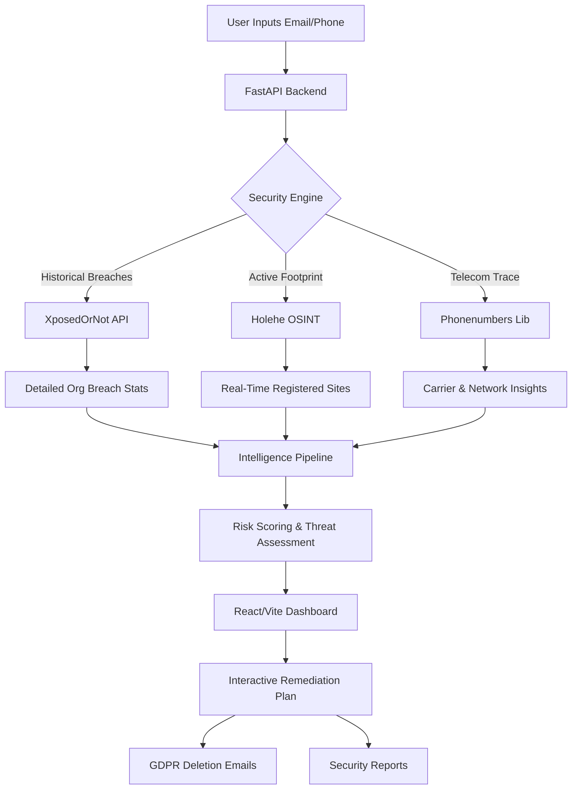

# DATAFENCE

> **Personal Data Exposure, Intelligence, and Adaptive Security Platform**

## 🚨 The Problem Statement
In today's highly interconnected digital landscape, individuals and organizations lack visibility into their digital footprint, leaving them critically vulnerable to data breaches, identity theft, and credential exploitation. Existing security tools are fragmented and reactive, failing to provide users with a centralized, actionable view of their exposed data across the web.

**DATAFENCE** solves this by providing a centralized, real-time intelligence engine that aggressively maps a user's digital footprint, analyzes historical breach data, predicts future vulnerabilities, and automates emergency remediation—empowering users to proactively reclaim their digital privacy.

---

## ✨ Features (Past to Present)
- **Authentication System**: Fully secure user registration, login, and JWT-based session management using SQLite and PBKDF2 hashing.
- **Telecom Footprint (Sanchar Saathi Trace)**: Analyzes phone numbers to determine region, carrier, and simulates linked digital SIM cards/services.
- **Historical Breach Analytics**: Deep integration with XposedOrNot APIs to not only detect if an email was breached, but to fetch the **specific breached organizations**, their domains, and the exact volume of compromised accounts.
- **Real-Time Active OSINT (Holehe)**: Actively pings password-recovery endpoints of 50+ popular services (Twitter, Spotify, Instagram, etc.) to discover active, unbreached accounts linked to an email in real-time.
- **Threat & Blast Radius Scoring**: An intelligent risk engine that correlates exposed data to determine potential identity inferences and blast radiuses.
- **Interactive Remediation Suite**: 
  - Generates an actionable step-by-step security checklist.
  - One-click **GDPR/CCPA Deletion Email** generation to privacy teams of breached organizations.
  - Direct secure links to vulnerable domains.
  - Exportable PDF/Text Security Audit Reports.

---

## 🛠️ Technology Stack
- **Frontend**: React, Vite, Lucide-React (Icons), Vanilla CSS (Custom Hacker/Glitch UI).
- **Backend**: Python, FastAPI, Uvicorn, Pydantic.
- **Database**: SQLite (Authentication & Sessions).
- **OSINT & APIs**: `holehe` (Footprint OSINT), `phonenumbers` (Telecom Intelligence), XposedOrNot API.
- **Containerization**: Docker & Docker Compose (with hot-reloading enabled).

---

## 📊 System Architecture & Flow Chart



---

## 🚀 How to Deploy / Run on Your System

This project is fully containerized with Docker, making it incredibly easy to deploy and develop. Hot-reloading is configured by default for both the frontend and backend.

### Prerequisites
- Install [Docker](https://docs.docker.com/get-docker/) and [Docker Compose](https://docs.docker.com/compose/install/).

### Step-by-Step Deployment

1. **Clone the Repository**
   ```bash
   git clone https://github.com/Krish-cys/DATAFENCE-git.git
   cd DATAFENCE-git
   ```

2. **Run with Docker Compose**
   Build and start the application in detached mode:
   ```bash
   sudo docker compose up --build -d
   ```

3. **Access the Application**
   - **Frontend UI**: Open your browser and go to `http://localhost:5173`
   - **Backend API**: Running at `http://localhost:8000`
   - **API Documentation (Swagger)**: `http://localhost:8000/docs`

4. **Stopping the Application**
   ```bash
   sudo docker compose down
   ```

### 👨‍💻 Development / Hot-Reloading
Because we have mounted the volumes in `docker-compose.yml` and enabled the `--reload` flags, **you do not need to restart Docker when changing code**.
- Any changes made to `frontend/src/*` will instantly reflect in the browser.
- Any changes made to `backend/app/*` will instantly restart the FastAPI server.
*(Note: If you add new dependencies to `package.json` or `requirements.txt`, you will need to run `sudo docker compose up --build -d` again).*